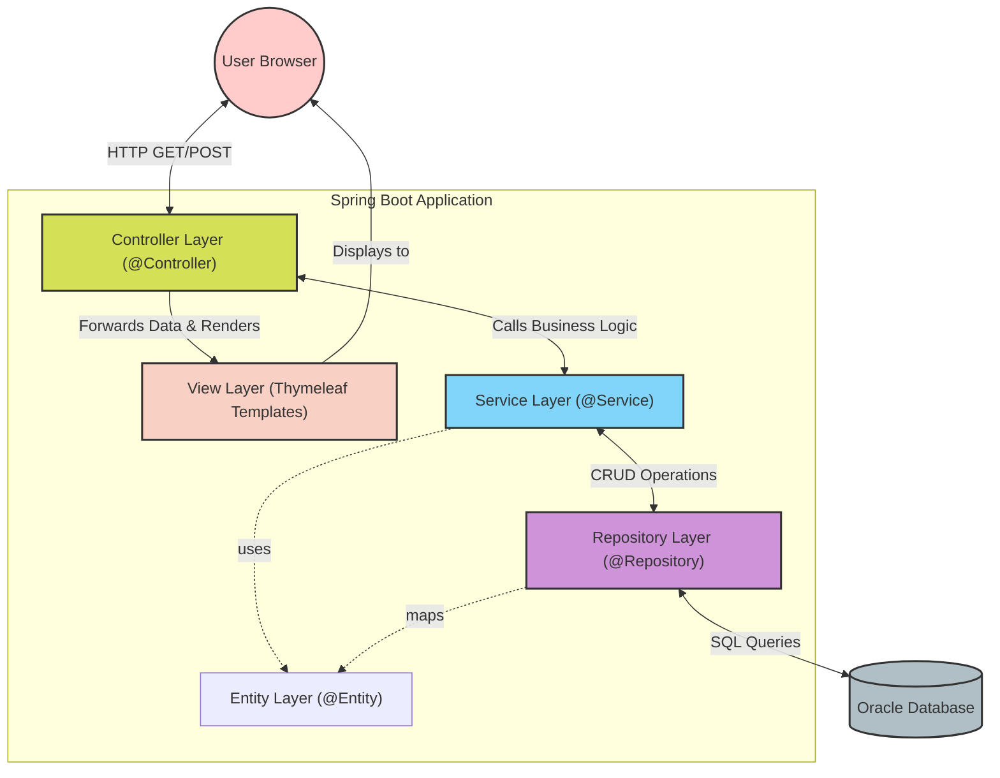
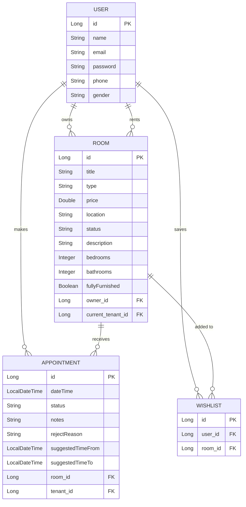
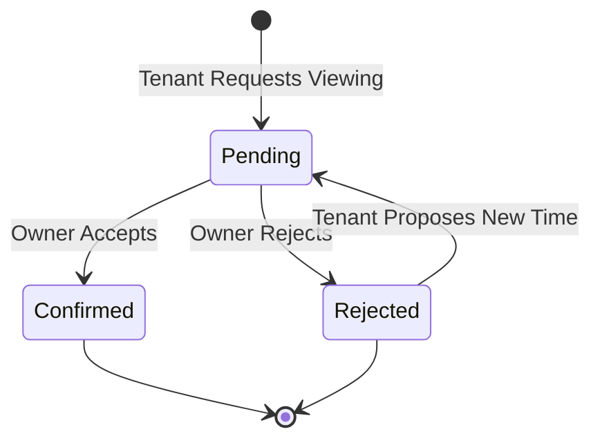

wh# System Design Document: Room Rental Management System

This document outlines the overall system architecture and functional modules of the Room Rental Management System. This project is built using Spring Boot, Thymeleaf, and Oracle Database.

## 1. System Architecture

The application follows a standard **Model-View-Controller (MVC)** layered architecture. This separates the application's concerns into three main layers:

- **Model Layer**: Represents the business logic and data state. Composed of Entities (mapped to the Oracle Database) and Spring Data JPA Repositories.
- **View Layer**: The presentation tier built with Thymeleaf templates. It dynamically renders HTML based on data provided by the Controllers.
- **Controller Layer**: Handles incoming HTTP requests, interacts with Services to process business rules, and returns the appropriate View.

### MVC Architecture Diagram

## 2. Technology Stack

- **Backend Framework**: Spring Boot 3.x (Java 17)
- **Frontend Template Engine**: Thymeleaf (HTML5, CSS)
- **Database**: Oracle Database (via `ojdbc11`)
- **ORM**: Spring Data JPA / Hibernate
- **Build Tool**: Maven
- **Other Utilities**: Lombok, Spring Boot Mail (for notifications)

---

## 3. Data Model (Entity-Relationship)

The system revolves around four main entities: `User`, `Room`, `Appointment`, and `Wishlist`.

---

## 4. Functional Modules

### 4.1 Authentication & User Management
- **User Registration & Login**: Users can sign up with their email, name, password, and phone number.
- **Profile Management**: Users can update their personal information and view their public profile.
- **Role Flexibility**: A user can act as both an **Owner** (listing rooms) and a **Tenant** (viewing rooms and making appointments).

### 4.2 Room Management (Owner Module)
- **Listing Creation**: Owners can create room listings, specifying the type (e.g., Whole Unit, Single Room), price, location, and detailed facilities (e.g., WiFi, air conditioning, fully furnished).
- **Listing Maintenance**: Owners can view and manage their listed rooms via the `My Rooms` dashboard.
- **Status Tracking**: Rooms have statuses indicating availability (e.g., Available, Rented).

### 4.3 Room Browsing & Wishlist (Tenant Module)
- **Dashboard & Search**: Tenants can view a dashboard of available rooms.
- **Detailed View**: Tenants can click into a room to see full details, facilities, and the owner's public profile.
- **Wishlist**: Users can save interesting rooms to their personal wishlist for later review.

### 4.4 Viewing Appointments Module
This is the core interaction feature connecting Tenants and Owners.
- **Booking**: A Tenant can request a viewing appointment for an available room by selecting a date and time and leaving notes.
- **Status Workflow**: 
  - **Pending**: Initial state when the tenant makes the request.
  - **Confirmed**: Owner accepts the viewing schedule.
  - **Rejected**: Owner declines the request, providing a `rejectReason` and optionally suggesting alternative times (`suggestedTimeFrom`, `suggestedTimeTo`).
- **Notifications**: Triggered via `EmailService` when appointment statuses change.

### Appointment Workflow Diagram

