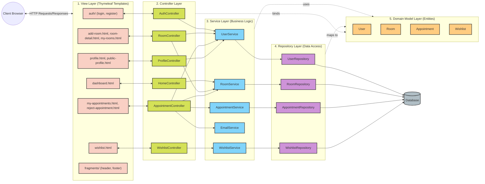

# MVC Architecture of the Application

Here is the detailed flowchart diagram of the MVC architecture for the Room Rental Management System, organized by layers (View, Controller, Service, Repository, and Model Entities).

## Layers Overview
- **View Layer**: Handles the presentation. Built using Thymeleaf templates (HTML/CSS) to render data sent from the Controllers.
- **Controller Layer**: Handles incoming HTTP requests, processes user input, orchestrates tasks with the Service layer, and returns the appropriate View or redirects.
- **Service Layer**: Contains the core business logic. It isolates the Controllers from data access details and coordinates between multiple repositories or external services (e.g., `EmailService`).
- **Repository Layer**: Interfaces for database operations using Spring Data JPA.
- **Model Layer**: JPA Entities that represent the database schema (users, rooms, appointments, wishlists) and are passed across layers.
